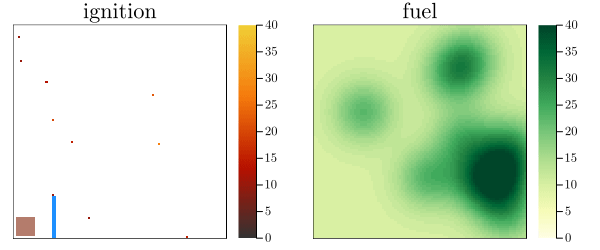

# WildfirePOMDPs.jl

An implementation of a wildfire MDP and POMDP.

> ⚠ The POMDP is a work-in-progress.

<p align="center">
  
</p>

Adapted from Griffith et al. "Automated Dynamic Resource Allocation for Wildfire Suppression" [^1].


## Installation
```julia
] add https://github.com/sisl/WildfirePOMDPs.jl
```

## Usage

```julia
using WildfirePOMDPs
mdp = WildfireMDP()

policy = RandomPolicy(mdp)
simulate(RolloutSimulator(max_steps=50), mdp, policy)
```

---
[^1] [Griffith, J. D., Kochenderfer, M. J., Moss, R. J., Mišić, V. V., Gupta, V., & Bertsimas, D. (2017). Automated Dynamic Resource Allocation for Wildfire Suppression. _Lincoln Laboratory Journal_.](https://www.ll.mit.edu/sites/default/files/page/doc/2018-06/22_2_3_Griffith.pdf)